# MIM: Mutual Information Machine

* Viewing this README.md in the <a href="https://github.com/seraphlabs-ca/MIM" target="_blank">github repo</a> will suffer from formatting issues. We recommend instead to view <a href="https://research.seraphlabs.ca/projects/mim/index.html" target="_blank">index.html</a> (can also be viewed locally).

## Links

* <a href="https://github.com/seraphlabs-ca/MIM" target="_blank">github repo</a>
* <a href="https://research.seraphlabs.ca/projects/mim/index.html" target="_blank">Project webpage</a>
* <a href="https://arxiv.org/abs/1910.03175" target="_blank">Preprint paper</a>
* <a href="https://research.seraphlabs.ca/presentations/mim-paper" target="_blank">Presentation</a>

## Why should you care? Posterior Collapse!

<div style="text-align: center; display:inline-block;">
    <div style="width: 30%; display:inline-block;">
        <p style="text-align: center;">AE (High MI, No Latent Prior)</p>
        
    </div>
    <div style="width: 30%; display:inline-block;">
        <p style="text-align: center;">MIM (High MI, Latent Prior Alignment)</p>
        
    </div>
    <div style="width: 30%; display:inline-block;">
        <p style="text-align: center;">VAE (High MI, Latent Prior Regularization)</p>
        
    </div>

    <p style="text-align: left; width: 60%; margin: auto;">
    MIM and VAE models with 2D inputs, and 2D latent space.
    <br>
    Top row: <b>Black</b> contours depict level sets of P(x); <span style="color: red">red</span> dots are reconstructed test points.
    <br>
    Bottom row: <span style="color: green">Green</span> contours are one standard deviation ellipses of q(z|x) for test points. Dashed black circles depict one standard deviation of P(z).
    <br>
    <br>
    </p>
    <ul style="text-align: left; width: 60%; margin: auto;">
        <li>AE (auto-encoder) produces zero predictive variance (i.e., delta function) and lower reconstruction errors, consistent with high mutual information. The structure in the latent space is the result of the architecture inductive bias. The lack of a prior leads to an undetermined alignment with P(z) (i.e., an arbitrary structure in the latent space).</li>
        <li>MIM produces lower predictive variance and lower reconstruction errors, consistent with high mutual information, alongside alignment with P(z) (i.e., structured latent space).</li>
        <li>VAE is optimized with annealing of beta in beta-VAE. Once annealing is completed (i.e., beta = 1), the VAE posteriors show  high predictive variance, which is indicative of partial posterior collapse. The increased variance leads to reduced mutual information and worse reconstruction error as a result of a strong alignment with P(Z) (i.e, overly structured/regularized latent space).</li>
    </ul>
</div>


## Requirements

The code has been tested on CPU and NVIDIA Titan Xp GPU, using Anaconda, Python 3.6, and zsh:

```
# tools
zsh 5.4.2
Cuda compilation tools, release 9.0, V9.0.176
conda 4.6.14
Python 3.6.8

# python packages (see requirements.txt for complete list)
scipy==1.1.0
matplotlib==3.0.3
numpy==1.15.4
torchvision==0.2.1
torch==1.0.0
scikit_learn==0.21.3
```

## Installation

Please follow installation instructions in the following link: [pytorch](https://pytorch.org).

```
pip install -r requirements.txt
```

## Data

The experiments can be run on the following datasets:

* [binary MNIST](http://yann.lecun.com/exdb/mnist/)
* [OMNIGLOT](https://github.com/yburda/iwae/blob/master/datasets/OMNIGLOT/chardata.mat)
* [Fashion-MNIST](https://github.com/zalandoresearch/fashion-mnist)

All datasets are included as part of the repo for convenience.
Links are provided as a workaround (i.e., in case of issues).

## Experiments

Directory structure (if code fail due to a missing directory please create manually):

```
src/ - Experiments are assumed to be executed from this directory.
data/assets - Datasets will be saved here.
data/torch-generated - Results will be saved here.
```

**NOTE (if code fails due to CUDA/GPU issues):** To prevent the use of CUDA/GPU and enforce CPU computation, please add the following flag to the supplied command lines below:

```
--no-cuda
```


Otherwise, by default CUDA will be used, if detected by pytorch. 

For detailed explanation of the plots below, please see the paper.

### Animation 

To produce the animation at the top:

```
# MIM
./vae-as-mim-dataset.py \
    --dataset toyMIM \
    --z-dim 2 \
    --mid-dim 50 \
    --min-logvar 6 \
    --seed 1 \
    --batch-size 128 \
    --epochs 49 \
    --warmup-steps 25 \
    --vis-progress \
    --mim-loss \
    --mim-samp
#VAE
./vae-as-mim-dataset.py \
    --dataset toyVAE \
    --z-dim 2 \
    --mid-dim 50 \
    --min-logvar 6 \
    --seed 1 \
    --batch-size 128 \
    --epochs 49 \
    --warmup-steps 25  \
    --vis-progress
#AE
./vae-as-mim-dataset.py \
    --dataset toyAE \
    --z-dim 2 \
    --mid-dim 50 \
    --min-logvar 6 \
    --seed 1 \
    --batch-size 128 \
    --epochs 49 \
    --warmup-steps 25  \
    --vis-progress \
    --ae-loss
```

### 2D Experiments

Experimenting with expressiveness of MIM and VAE:

```
for seed in 1 2 3 4 5 6 7 8 9 10; do
        for mid_dim in 5 20 50 100 200 300 400 500; do
            # MIM
            ./vae-as-mim-dataset.py \
                --dataset toy4 \
                --z-dim 2 \
                --mid-dim ${mid_dim} \
                --min-logvar 6 \
                --seed ${seed} \
                --batch-size 128 \
                --epochs 200 \
                --warmup-steps 3 \
                --mim-loss \
                --mim-samp
            # VAE
            ./vae-as-mim-dataset.py \
                --dataset toy4 \
                --z-dim 2 \
                --mid-dim ${mid_dim} \
                --min-logvar 6 \
                --seed ${seed} \
                --batch-size 128 \
                --epochs 200 \
                --warmup-steps 3
        done
done
```

Results below demonstrate posterior collapse in VAE, and the lack of it in MIM.

<div style="text-align: center; width: 100%;">
    <div style="width: 48%; display:inline-block; vertical-align:middle;">
        <p style="text-align: center;">MIM (5, 20, 500 hidden units)</p>
        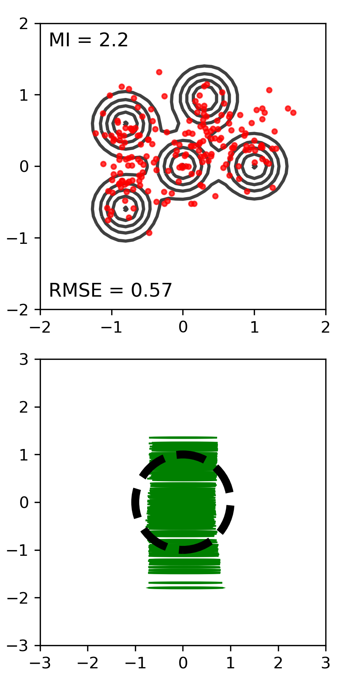
        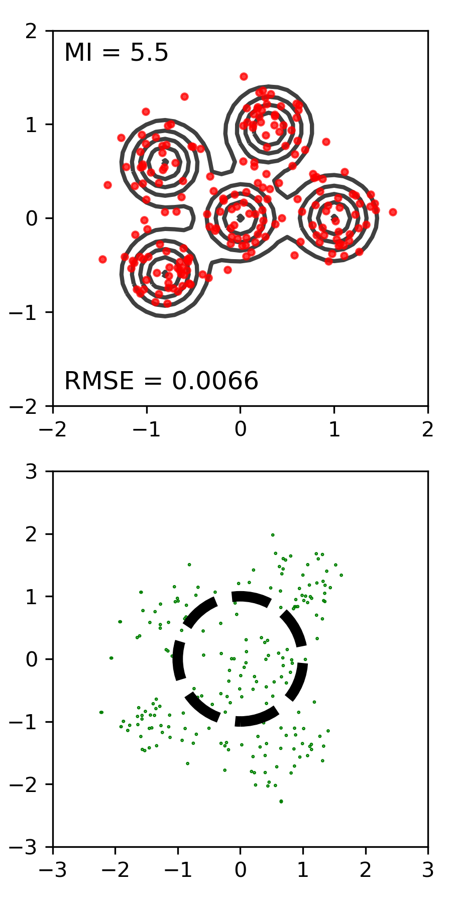
        
    </div>
    <div style="width: auto; height: 200px; display:inline-block; vertical-align:middle; padding-left: 2%;"></div>
    <div style="width: 48%; display:inline-block; vertical-align:middle;">
        <p style="text-align: center;">VAE (5, 20, 500 hidden units)</p>
        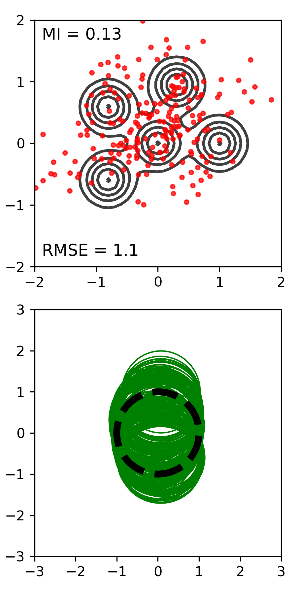
        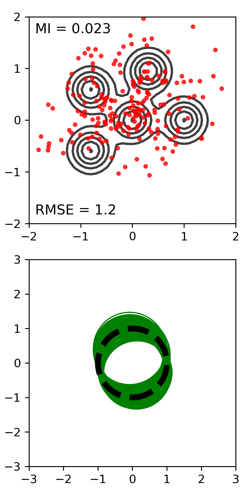
        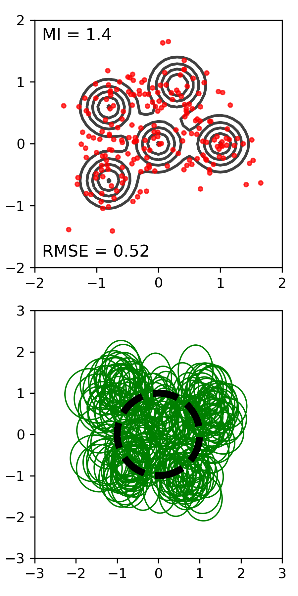
    </div>

    <div style="text-align: left; width: 9%; display: inline-block"><span style="color: blue;">MIM</span><br><span style="color: red;">VAE</span></div>
    <div style="width: 20%; display:inline-block;">
        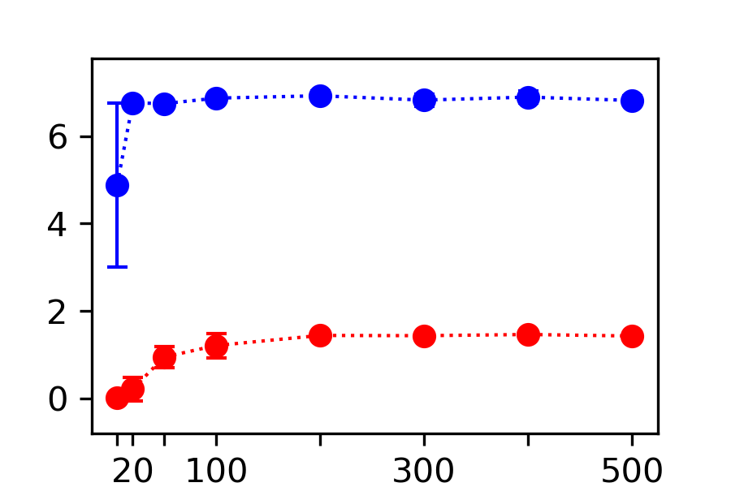
        <p style="text-align: center;">MI</p>    
    </div>
    <div style="width: 20%; display:inline-block;">
        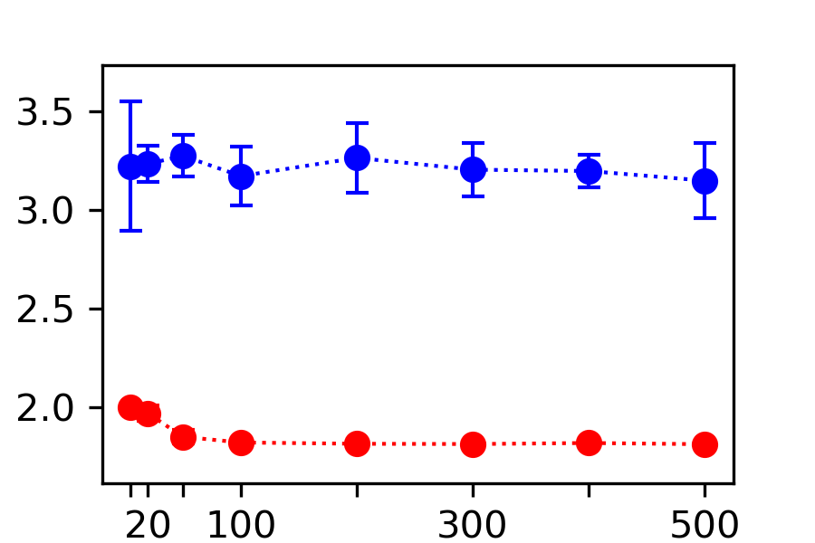
        <p style="text-align: center;">NLL</p>    
    </div>
    <div style="width: 20%; display:inline-block;">
        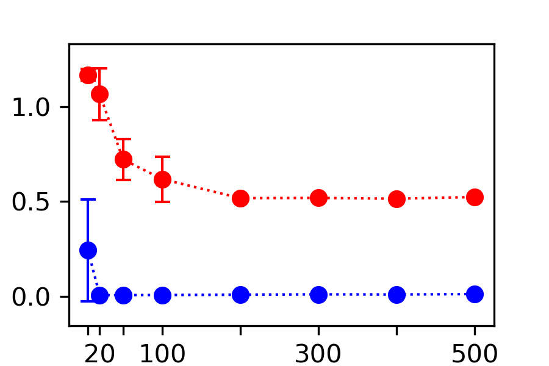
        <p style="text-align: center;">Recon. RMSE</p>    
    </div>
    <div style="width: 20%; display:inline-block;">
        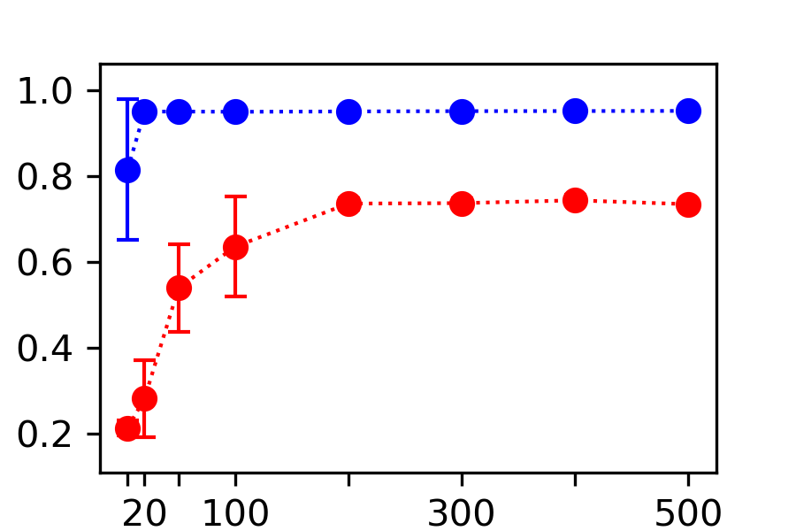
        <p style="text-align: center;">Classification Acc.</p>    
    </div>
</div>

Experimenting with effect of entropy prior on MIM and VAE:

```
for seed in 1 2 3 4 5 6 7 8 9 10; do
        for mid_dim in 5 20 50 100 200 300 400 500; do
                # MIM
                ./vae-as-mim-dataset.py \
                    --dataset toy4 \
                    --z-dim 2 \
                    --mid-dim ${mid_dim} \
                    --min-logvar 6 \
                    --seed ${seed} \
                    --batch-size 128 \
                    --epochs 200 \
                    --warmup-steps 3 \
                    --mim-loss \
                    --mim-samp \
                    --inv-H-loss
                # VAE
                ./vae-as-mim-dataset.py \
                    --dataset toy4 \
                    --z-dim 2 \
                    --mid-dim ${mid_dim} \
                    --min-logvar 6 \
                    --seed ${seed} \
                    --batch-size 128 \
                    --epochs 200 \
                    --warmup-steps 3 \
                    --inv-H-loss
        done
done
```

Results below demonstrate how adding joint entropy as regularizer can prevent posterior collapse in VAE, and subtracting the joint entropy can generate a strong collapse in MIM.

<div style="text-align: center; width: 100%;">
    <div style="width: 48%; display:inline-block;">
        <p style="text-align: center;">MIM - H (5, 20, 500 hidden units)</p>
        
        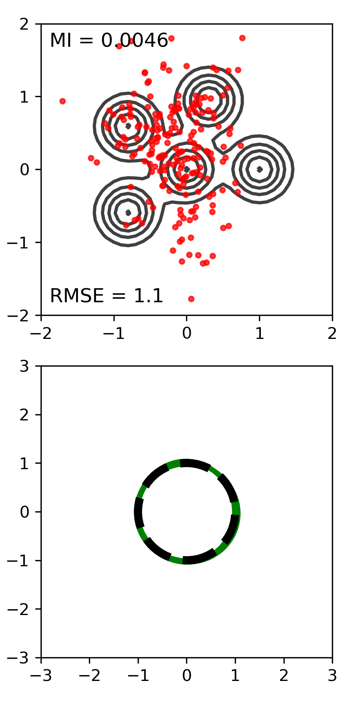
        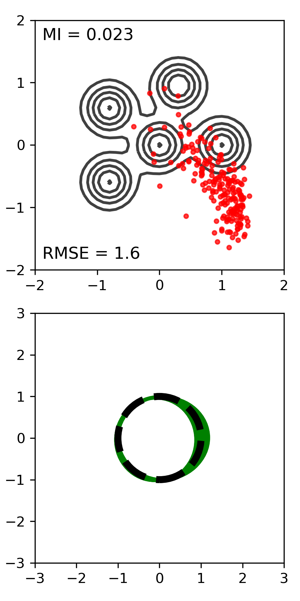
    </div>
    <div style="width: 48%; display:inline-block;">
        <p style="text-align: center;">VAE + H (5, 20, 500 hidden units)</p>
        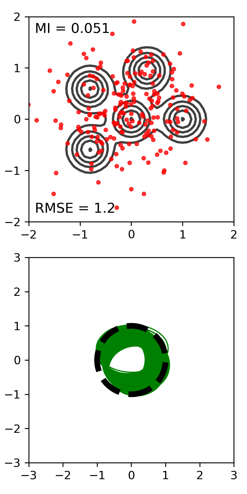
        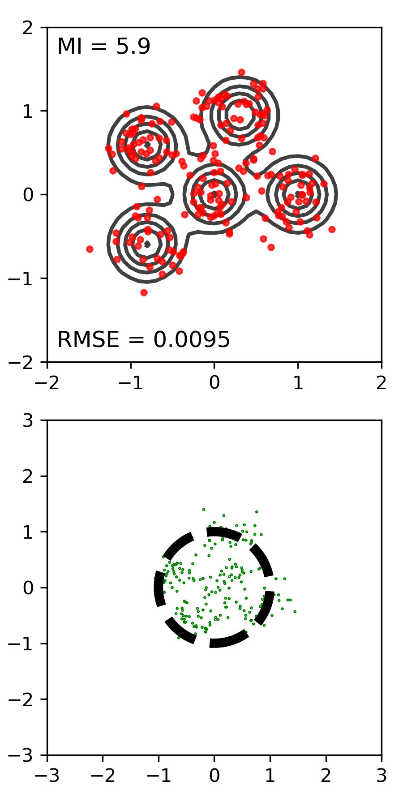
        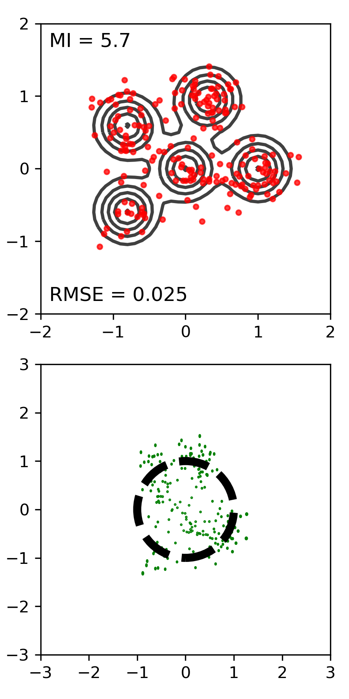
    </div>

    <div style="text-align: left; width: 9%; display: inline-block"><span style="color: blue;">MIM</span><br><span style="color: red;">VAE</span></div>
    <div style="width: 20%; display:inline-block;">
        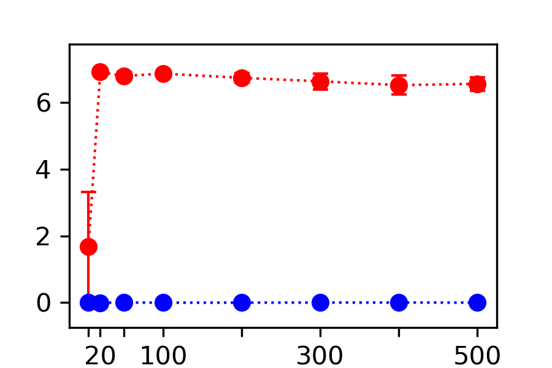
        <p style="text-align: center;">MI</p>    
    </div>
    <div style="width: 20%; display:inline-block;">
        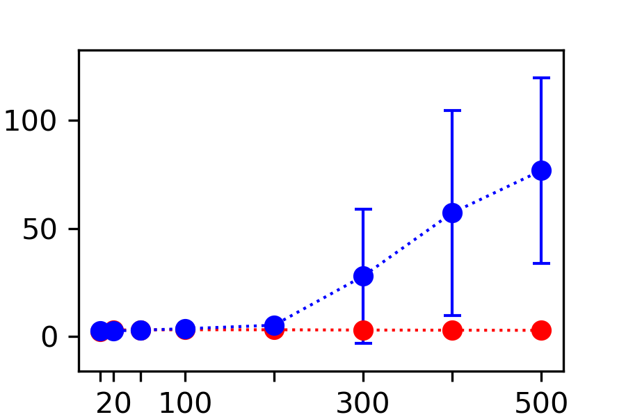
        <p style="text-align: center;">NLL</p>    
    </div>
    <div style="width: 20%; display:inline-block;">
        
        <p style="text-align: center;">Recon. RMSE</p>    
    </div>
    <div style="width: 20%; display:inline-block;">
        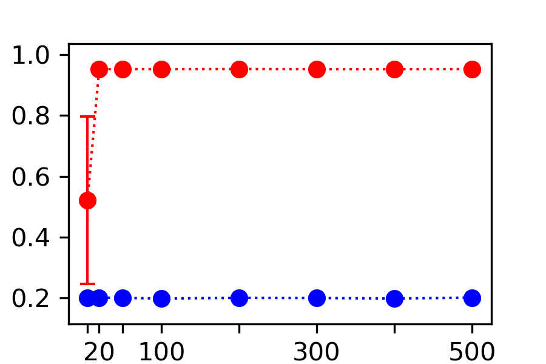
        <p style="text-align: center;">Classification Acc.</p>    
    </div>
</div>

### Bottleneck

Experimenting with effect of bottleneck on VAE and MIM.

#### 20D with 5 GMM

A synthetic 5 GMM dataset with 20D x:

```
for seed in 1 2 3 4 5 6 7 8 9 10; do
        for z_dim in 2 4 6 8 10 12 14 16 18 20; do
            # MIM
            ./vae-as-mim-dataset.py \
                --dataset toy4_20  \
                --z-dim ${z_dim}  \
                --mid-dim 50  \
                --seed ${seed}  \
                --epochs 200   \
                --min-logvar 6  \
                --warmup-steps 3   \
                --mim-loss  \
                --mim-samp
            # VAE
            ./vae-as-mim-dataset.py  \
                --dataset toy4_20   \
                --z-dim ${z_dim}  \
                --mid-dim 50  \
                --seed ${seed}  \
                --epochs 200  \
                --min-logvar 6  \
                --warmup-steps 3
        done
done
```

Results below demonstrate posterior collapse in VAE which worsen as the latent dimensionality increases, and the lack of it in MIM.

<div style="text-align: center; width: 100%;">
    <div style="text-align: left; width: 9%; display: inline-block"><span style="color: blue;">MIM</span><br><span style="color: red;">VAE</span></div>
    <div style="width: 20%; display:inline-block;">
        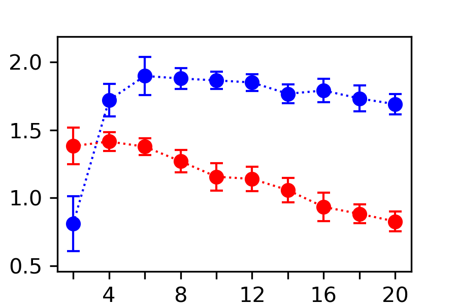
        <p style="text-align: center;">MI</p>    
    </div>
    <div style="width: 20%; display:inline-block;">
        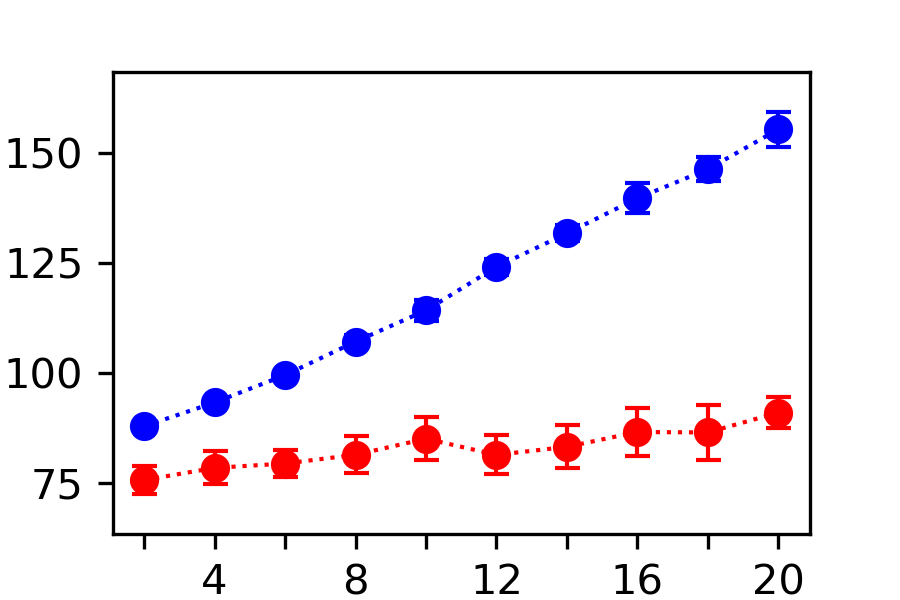
        <p style="text-align: center;">NLL</p>    
    </div>
    <div style="width: 20%; display:inline-block;">
        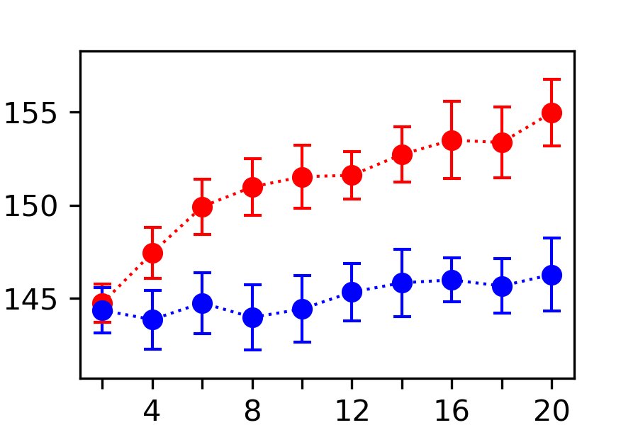
        <p style="text-align: center;">Recon. RMSE</p>    
    </div>
    <div style="width: 20%; display:inline-block;">
        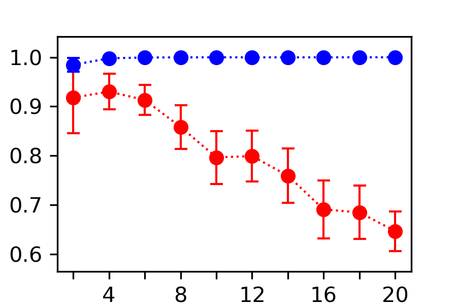
        <p style="text-align: center;">Classification Acc.</p>    
    </div>
</div>

#### 20D with Fashion-MNIST PCA

A PCA reduction of Fashion-MNIST to 20D x:

```
for seed in 1 2 3 4 5 6 7 8 9 10; do
    for z_dim in 2 4 6 8 10 12 14 16 18 20; do
            # MIM
            ./vae-as-mim-dataset.py  \
                --dataset pca-fashion-mnist20   \
                --z-dim ${z_dim}  \
                --mid-dim 50  \
                --seed ${seed}  \
                --epochs 200  \
                --min-logvar 6  \
                --warmup-steps 3  \
                --mim-loss  \
                --mim-samp
            # VAE
            ./vae-as-mim-dataset.py  \
                --dataset pca-fashion-mnist20   \
                --z-dim ${z_dim}  \
                --mid-dim 50  \
                --seed ${seed}  \
                --epochs 200  \
                --min-logvar 6  \
                --warmup-steps 3
        done
done
```

Results below demonstrate posterior collapse in VAE which worsen as the latent dimensionality increases, and the lack of it in MIM. Here, for real-world data observations.

<div style="text-align: center; width: 100%;">
    <div style="text-align: left; width: 9%; display: inline-block"><span style="color: blue;">MIM</span><br><span style="color: red;">VAE</span></div>
    <div style="width: 20%; display:inline-block;">
        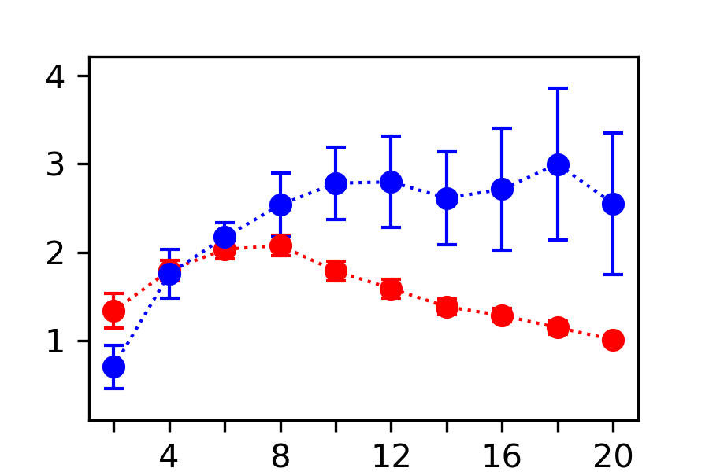
        <p style="text-align: center;">MI</p>    
    </div>
    <div style="width: 20%; display:inline-block;">
        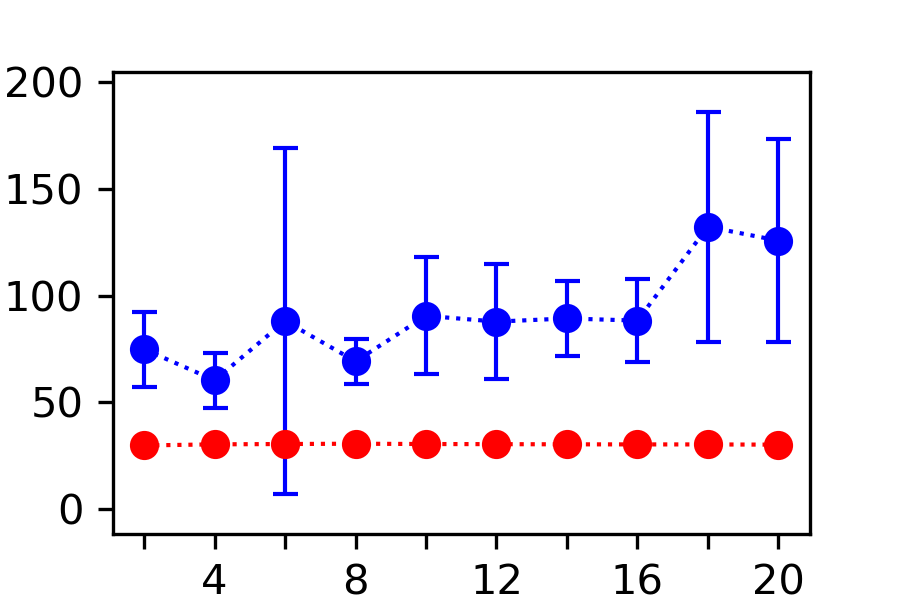
        <p style="text-align: center;">NLL</p>    
    </div>
    <div style="width: 20%; display:inline-block;">
        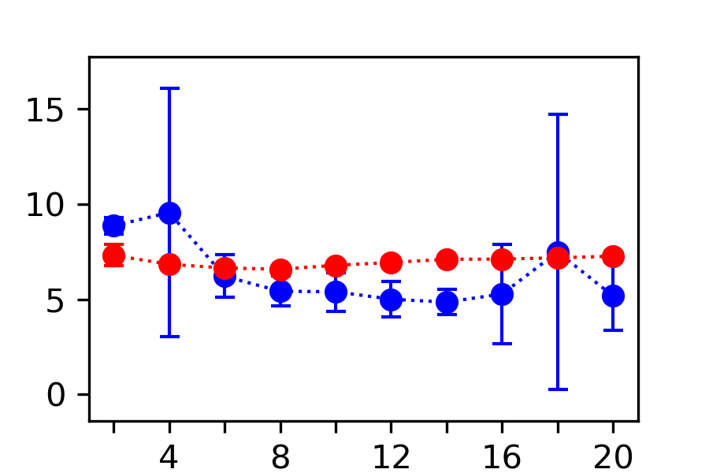
        <p style="text-align: center;">Recon. RMSE</p>    
    </div>
    <div style="width: 20%; display:inline-block;">
        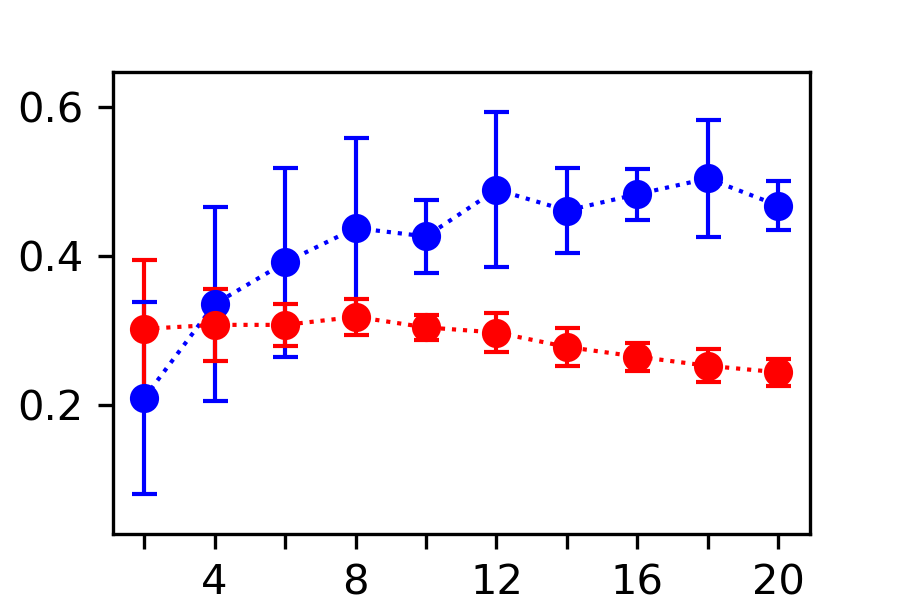
        <p style="text-align: center;">Classification Acc.</p>    
    </div>
</div>

### High Dimensional Image Data

Experimenting with high dimensional image data where we cannot reliably measure mutual information:

```
for seed in 1 2 3 4 5 6 7 8 9 10; do
    for dataset_name in dynamic_mnist dynamic_fashion_mnist omniglot; do
        for model_name in convhvae_2level convhvae_2level-smim pixelhvae_2level pixelhvae_2level-amim; do
            for prior in vampprior standard; do
                ./vae-as-mim-image.py \
                    --dataset_name ${dataset_name} \
                    --model_name ${model_name} \
                    --prior ${prior} \
                    --seed ${seed} \
                    --use_training_data_init
            done
        done
    done
done
```

Results below demonstrate comparable sampling and reconstruction of VAE and MIM, and better unsupervised clustering for MIM, as a result of higher mutual information.

<div style="text-align: center; width: 100%;">
    <div style="width: 8%; height: 100%; display:inline-block;"></div>
    <div style="width: 90%; display:inline-block;">
        <div style="width: 30%; display:inline-block; vertical-align:middle;">
            <p style="text-align: center;">Samples</p>    
        </div>
        <div style="width: 30%; display:inline-block; vertical-align:middle;">
            <p style="text-align: center;">Reconstruction</p>    
        </div>
        <div style="width: 30%; display:inline-block; vertical-align:middle;">
            <p style="text-align: center;">Latent Embeddings</p>    
        </div>
    </div>
    <div style="width: 8%; height: 100%; display:inline-block;">MIM</div>
    <div style="width: 90%; display:inline-block; vertical-align:middle;">
        <div style="width: 30%; display:inline-block; vertical-align:middle;">
            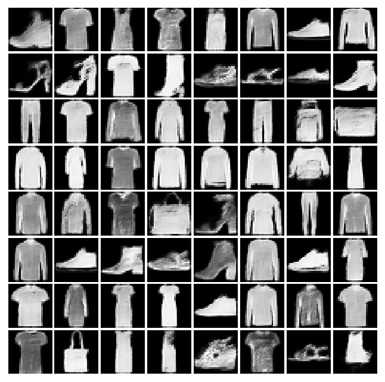
        </div>
        <div style="width: 30%; display:inline-block; vertical-align:middle;">
            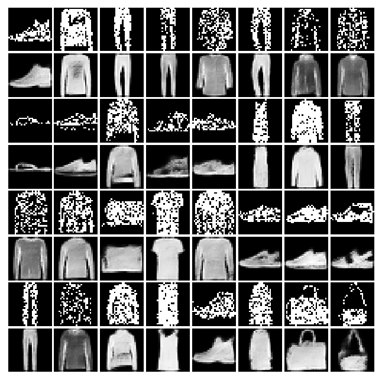
        </div>
        <div style="width: 30%; display:inline-block; vertical-align:middle;">
            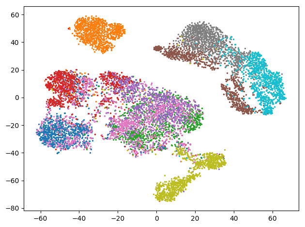
        </div>
    </div>
    <div style="width: 8%; height: 100%; display:inline-block;">VAE</div>
    <div style="width: 90%; display:inline-block; vertical-align:middle;">
        <div style="width: 30%; display:inline-block; vertical-align:middle;">
            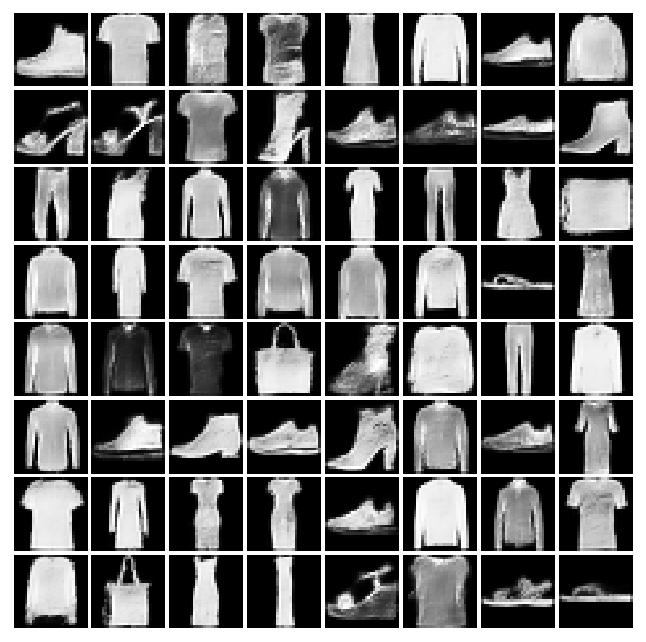
        </div>
        <div style="width: 30%; display:inline-block; vertical-align:middle;">
            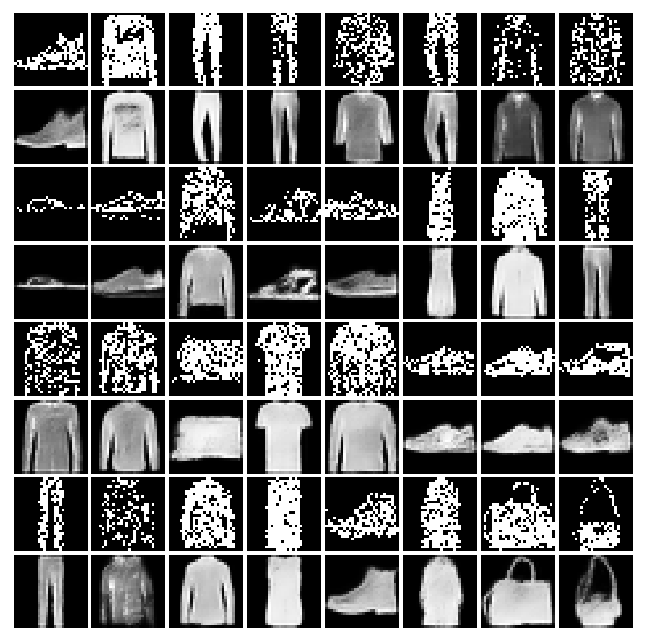
        </div>
        <div style="width: 30%; display:inline-block; vertical-align:middle;">
            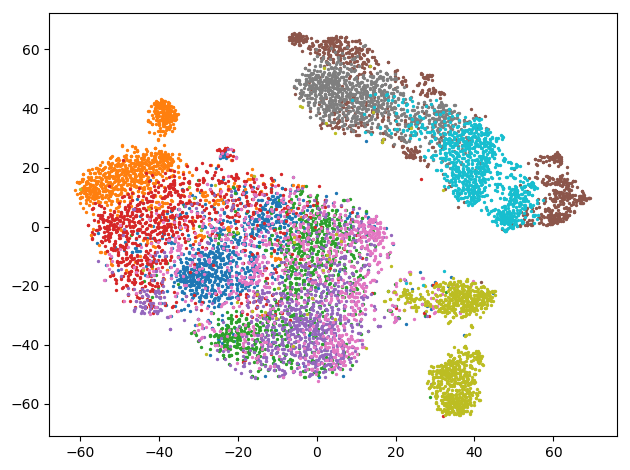
        </div>
    </div>
    <p style="text-align: center;"><b>Fashion-MNIST</b></p>    
</div>


<div style="text-align: center; width: 100%;">
    <div style="width: 8%; height: 100%; display:inline-block;"></div>
    <div style="width: 90%; display:inline-block;">
        <div style="width: 30%; display:inline-block; vertical-align:middle;">
            <p style="text-align: center;">Samples</p>    
        </div>
        <div style="width: 30%; display:inline-block; vertical-align:middle;">
            <p style="text-align: center;">Reconstruction</p>    
        </div>
        <div style="width: 30%; display:inline-block; vertical-align:middle;">
            <p style="text-align: center;">Latent Embeddings</p>    
        </div>
    </div>
    <div style="width: 8%; height: 100%; display:inline-block;">MIM</div>
    <div style="width: 90%; display:inline-block; vertical-align:middle;">
        <div style="width: 30%; display:inline-block; vertical-align:middle;">
            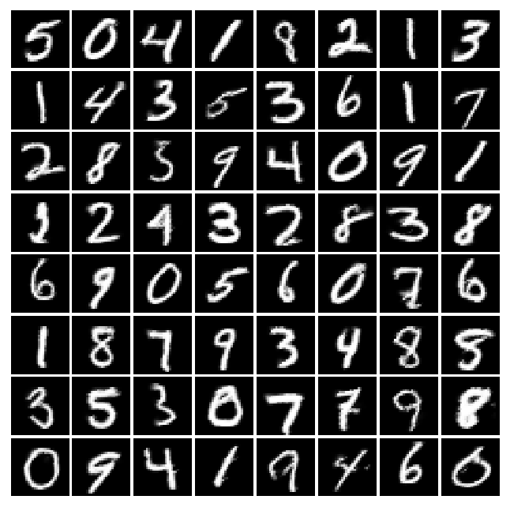
        </div>
        <div style="width: 30%; display:inline-block; vertical-align:middle;">
            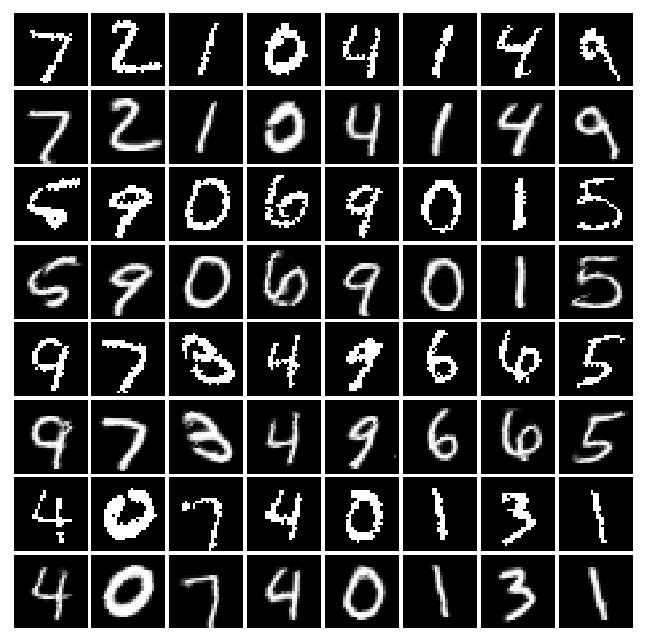
        </div>
        <div style="width: 30%; display:inline-block; vertical-align:middle;">
            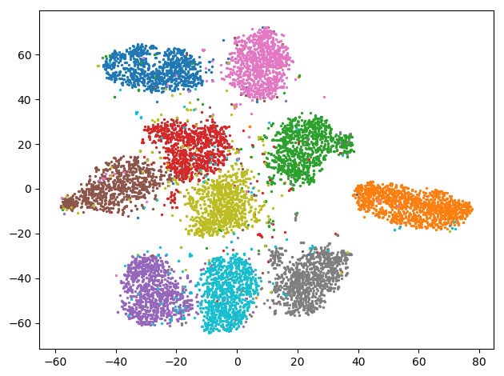
        </div>
    </div>
    <div style="width: 8%; height: 100%; display:inline-block;">VAE</div>
    <div style="width: 90%; display:inline-block; vertical-align:middle;">
        <div style="width: 30%; display:inline-block; vertical-align:middle;">
            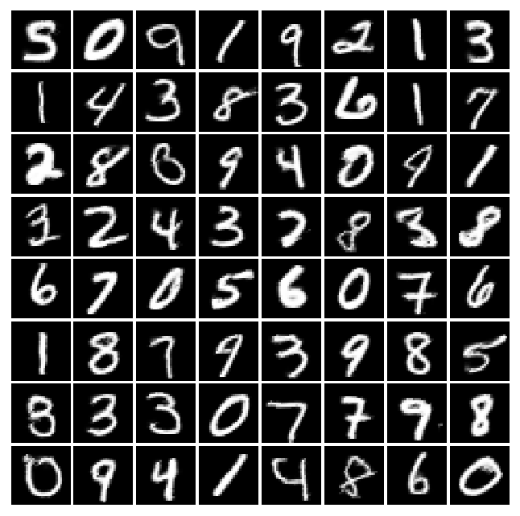
        </div>
        <div style="width: 30%; display:inline-block; vertical-align:middle;">
            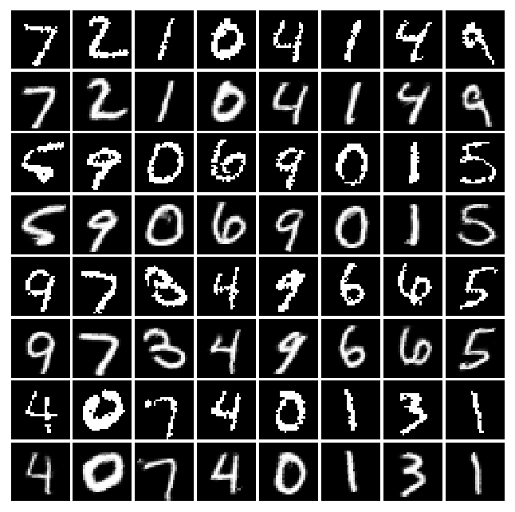
        </div>
        <div style="width: 30%; display:inline-block; vertical-align:middle;">
            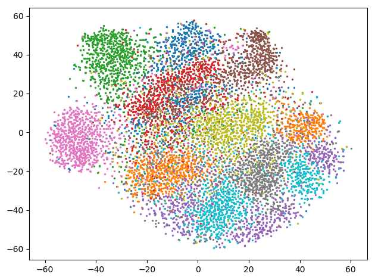
        </div>
    </div>
    <p style="text-align: center;"><b>MNIST</b></p>    
</div>

Code for this experiment is based on <a href="https://github.com/jmtomczak/vae_vampprior" target="_blank">Vamprior</a> paper

```
@article{TW:2017,
  title={{VAE with a VampPrior}},
  author={Tomczak, Jakub M and Welling, Max},
  journal={arXiv},
  year={2017}
}
```

## Citation

Please cite our <a href="https://arxiv.org/abs/1910.03175" target="_blank">paper</a> if you use this code in your research:

```
@misc{livne2019mim,
    title={MIM: Mutual Information Machine},
    author={Micha Livne and Kevin Swersky and David J. Fleet},
    year={2019},
    eprint={1910.03175},
    archivePrefix={arXiv},
    primaryClass={cs.LG}
}
```

## Acknowledgements

Many thanks to Ethan Fetaya, Jacob Goldberger, Roger Grosse, Chris Maddison, 
and Daniel Roy for interesting discussions and for their helpful comments.
We are especially grateful to Sajad Nourozi for extensive discussions and for 
his help to empirically validate the formulation and experimental work.
This work was financially supported in part by the Canadian Institute for 
Advanced Research (Program on Learning in Machines and Brains), and NSERC Canada.

## Your Feedback Is Appreciated

If you find this paper and/or repo to be useful, we would love to hear back!
Tell us your success stories, and we will include them in this README.
